# Progression

Use the mouse wheel to indicate your progression in each world.

### Hollow Bastion

Icon                | Description
:-----------------------------:|:---------------------------------:
 | Finished first visit
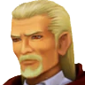 | Left at Ansem's study
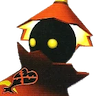 | Finished Crimson Jazz fight outside Ansem's study
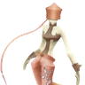 | Finished Dancer fight at Restoration Site
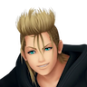 | Finished Demyx
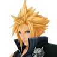 | Finished Final Fantasy fights
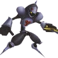 | Finished 1,000 heartless fight
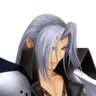 | Finished Sephiroth
 | Full cleared (including Data Demyx)

### Twilight Town

Icon                | Description
:-----------------------------:|:---------------------------------:
 | Finished first visit
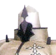 | Finished Berserker fight at Sandlot
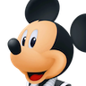 | Finished Mickey fight outside Mansion
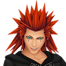 | Finished Axel fight at Betwixt & Between
 | Full cleared (including Data Axel)

### Land of Dragons

Icon                | Description
:-----------------------------:|:---------------------------------:
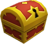 | Checked the first few chests
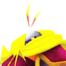 | Finished cave fight
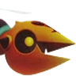 | Finished timed Rapid Thruster fight
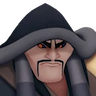 | Finished Shan Yu
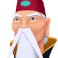 | Visited Throne Room
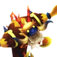 | Finished Storm Rider
 | Full cleared (including Data Xigbar)

### Beast's Castle

Icon                | Description
:-----------------------------:|:---------------------------------:
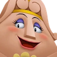 | Finished the wardrobe mini-game
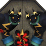 | Finished Thresholder/Possessor
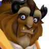 | Finished fight against Beast
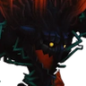 | Finished Dark Thorn
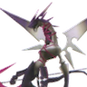 | Finished Dragoon fight before Xaldin
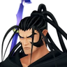 | Finished Xaldin
 | Full cleared (including Data Xaldin)

### Olympus Coliseum

Icon                | Description
:-----------------------------:|:---------------------------------:
 | Checked the first few chests
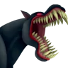 | Finished Cerberus
 | Finished Demyx
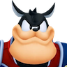 | Finished Pete
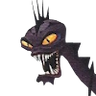 | Finished Hydra
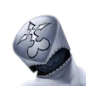 | Finished Dusk fight before Hades
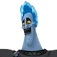 | Finished Hades
 | Full cleared (including Zexion)

### Space Paranoids

Icon                | Description
:-----------------------------:|:---------------------------------:
 | Checked the first few chests
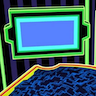 | Finished Screens room
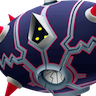 | Finished Hostile Program
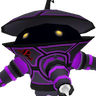 | Finished Solar Sailer
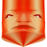 | Finished MCP
 | Full cleared (including Larxene)

### Halloween Town

Icon                | Description
:-----------------------------:|:---------------------------------:
 | Checked the first few chests
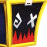 | Finished Toy Soldier fight
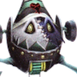 | Finished Prison Keeper
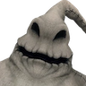 | Finished Oogie Boogie
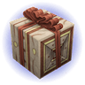 | Finished presents collection fight
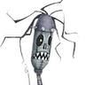 | Finished Experiment
 | Full cleared (including Vexen)

### Port Royal

Icon                | Description
:-----------------------------:|:---------------------------------:
 | Checked the first few chests
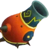 | Finished Town fights
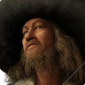 | Finished Barbossa
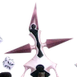 | Finished Gambler fight
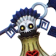 | Finished Grim Reaper 2
 | Full cleared (including Data Luxord)

### Agrabah

Icon                | Description
:-----------------------------:|:---------------------------------:
 | Checked the first few chests
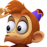 | Finished Abu mini-game
 | Finished Chasm of Challenges
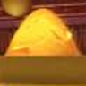 | Finished Treasure Room fight
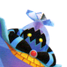 | Finished Volcano/Blizzard Lords
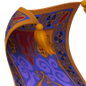 | Finished Carpet mini-games
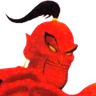 | Finished Genie Jafar
 | Full cleared (including Lexaeus)

### Disney Castle

Icon                | Description
:-----------------------------:|:---------------------------------:
 | Checked the first few chests
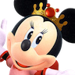 | Finished Minnie escorts
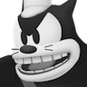 | Finished Old Pete
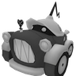 | Finished Windows fights
 | Finished Pete/Pete
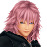 | Finished Marluxia
 | Full cleared (including Lingering Will)

### 100 Acre Wood

Icon                | Description
:-----------------------------:|:---------------------------------:
 | Finished Pooh's House
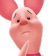 | Finished Piglet's House
 | Finished Rabbit's House
 | Finished Kanga's House
 | Finished Spooky Cave
 | Full cleared to Starry Hill

### Simulated Twilight Town

Icon                | Description
:-----------------------------:|:---------------------------------:
 | Finished up to Mansion Computer Room
 | Finished Axel fight
 | Full cleared (including Data Roxas)

### The World That Never Was

Icon                | Description
:-----------------------------:|:---------------------------------:
 | Checked the first few chests
 | Finished Roxas
 | Finished Xigbar
 | Finished Luxord
 | Finished Saix
 | Finished Xemnas 1
 | Full cleared (including Data Xemnas)
