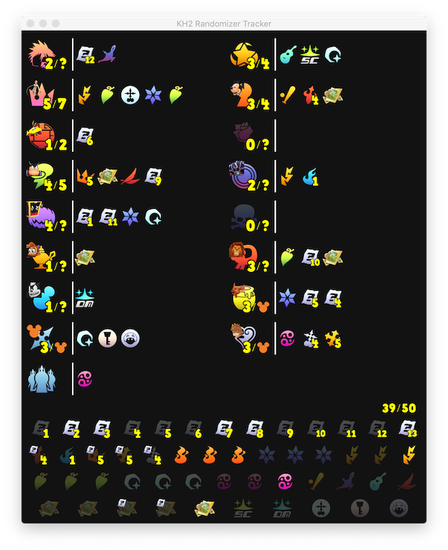

# kh2-rando-tracker

Kingdom Hearts 2 Randomizer item tracker inspired heavily by the following trackers:

- [TrevorLuckey/KH2Tracker](https://github.com/TrevorLuckey/KH2Tracker)
- [ShinyGoombah/KH2-Rando-Tracker](https://github.com/ShinyGoombah/KH2-Rando-Tracker)
- [zaxutic/kh2fm-rando-tracker](https://github.com/zaxutic/kh2fm-rando-tracker)

### Why another tracker?

- Attempt to be a hybrid of features from other trackers
- Ability to run on MacOS
- To scratch a programming itch

### Screenshots

Tracker window                | Broadcast window
:-----------------------------:|:---------------------------------:
 | 

### Features

#### Integration with [Jsmartee's hint system](https://jsmartee.github.io/kh2fm-hints-demo/)

- Drag and drop a saved hint file onto the tracker window to load the hints, or click "Load hints" to open a file
  chooser
- Automatically applies settings from the hint file
  - Whether Simulated Twilight Town, Atlantica, etc. are enabled
    - Any location not enabled will not display in the tracker or broadcast window
  - Whether Promise Charm is enabled
    - If disabled, Promise Charm will not display in the tracker or broadcast window
  - Whether Cure, Final Form, Second Chance/Once More, etc. are included in the important checks pool
    - Any item not included in the important check pool can still be marked as collected in its location, but the
      counters for number of found and total important checks won't include it
  - etc.
- Correctly placing an Ansem report in a location displays the hint text and reveals the number of important checks for
  the hinted location
- Incorrectly placing an Ansem report three times locks you out of that hint

#### Tracker window

- Displays each location, a counter of found and total important checks, and the pool of important checks
- Click a location to set as your active location
  - The first time you set a location as active, it will light up to indicate you've been there
  - Click an item to mark that item as collected in the active location
  - Click a marked item to return it to the pool
  - Click a correctly placed Ansem report to display its hint text again
- Use the scroll wheel to update a location's visited status between visited and un-visited
- Use the scroll wheel on a drive form item to adjust the form's level
  - Can do this in any place the drive form appears in the tracker window
  - Can do this to indicate form levels gained using auto forms before the actual drive form has been obtained
- Place items in the Garden of Assemblage location to indicate that they were items that were in the 3 GoA chests or
  items that you started the seed with

#### Broadcast window

- Displays a broadcast-friendly summary of the locations and important checks, synchronized with the tracker window
- Includes a row summarizing collected Ansem reports, torn pages, and total important checks

#### Other

- The tracker automatically saves progress on exit. Use File -> Reset to reset the tracker in order to select a new hint
  file.
- The icons for locations and items can be configured separately to use different icon sets using the Options menu
  - "classic" icons that closely resemble those in the game
  - "minimal"/simplified icons

#### To do

- Drag and drop support
- Remember window positions and sizes
- Add progression support to indicate how far you've gone in each world
- Investigate Windows/Linux executables
